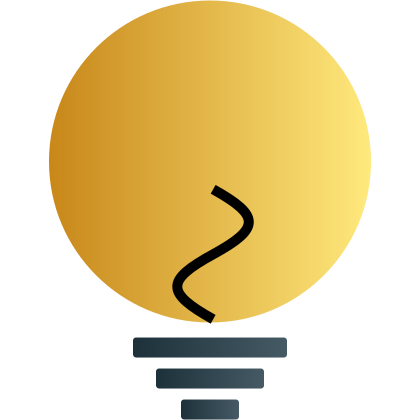

<!-- design inspired by https://github.com/kamranahmedse/developer-roadmap -->

  
  <h2 align="center">Opinion Me</h2>
  
Web App for getting feedback and giving feedback on ideas.

  

    &nbsp;&nbsp;<a href="./docs/roadmap.md">Roadmap</a>&nbsp;&nbsp;
    &nbsp;&nbsp;<a href="https://github.com/angular/angular-cli">Angular v14</a>&nbsp;&nbsp;
    &nbsp;&nbsp;<a href="https://opinion-me-testing.web.app">WebApp</a>&nbsp;&nbsp;
    &nbsp;&nbsp;<a href="./README.md#Contribute">Contribute</a>&nbsp;&nbsp;
  

The main purpose of this project was to learn Angular and Firebase, by creating a web app for getting feedback and giving feedback on ideas.

## Contribute

Feel free to issue bug reports and feature requests.

Please first check the [roadmap](./docs/roadmap.md) and existing [issues](../../issues).

If you want to write it yourself- open an issue and declare your intension. [PRs](../../pulls) will be wellcomed.

## Development

Please install [yarn](https://classic.yarnpkg.com/lang/en/docs/install/).

For a dev server Run `yarn && yarn start` (The application will automatically reload if you change any of the source files).

Navigate to [`http://localhost:4200/`](http://localhost:4200/).

### Running unit tests

Run `yarn test` to execute the unit tests via [Karma](https://karma-runner.github.io).

(Run `yarn run fire-emu` and then `yarn run fire-test` to unit test firestore rules)
